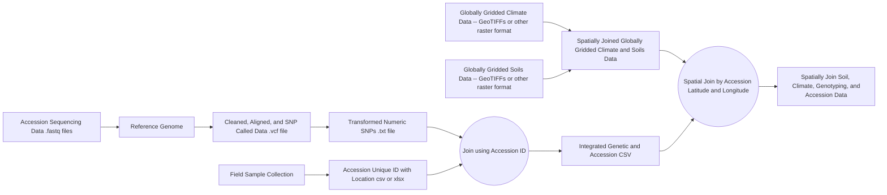

# Genome Enviroment Association Workshop

This is a series of lessons accompanied by scripts to conduct Genome Environmental Association Analysis and Genomic Environmental Selection Analysis.

The observation unit for the data in this workshop is an `accession` with the location where it was collected as a `latitude` and `longitude`. The problem is that this information is disconnected from the data capture processes for the environmental data and the lab-based sequencing workflows for genotyping. An highly generalized workflow for GEA can be seen below.

# Steps
1) Getting accession geolocation information and mapping accession location
2) Accessing genomic data
3) Accessing climate and soil data 
4) Cleaning genomic data
5) Analysing population structure
6) Calculating LD decay
7) Performing the EAA (Environmental Association Analysis) & EAA (Environmental Association Analysis) Model Checking
8) Identifying candidate genomic regions and genes in LD with those regions
9) Performing the EGS (Environmental Genomic Selection)

